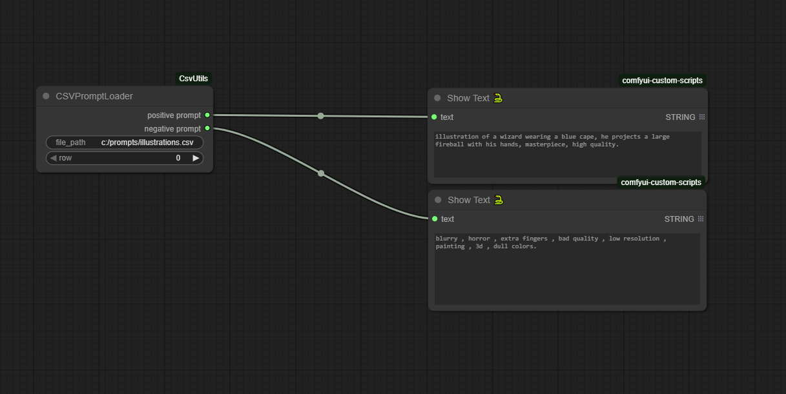

# Csv Utils


## Setup

- simply clone this repo into the `comfyui/custom_nodes/` folder : 

```
git clone https://github.com/SanicsP/ComfyUI-CsvUtils.git
```

- restart ComfyUI

- Nodes have no external dependencies, no need for the manager, the built-in python csv library is simply used

## Nodes 

#### CSVPromptSaver

This node allows you to save negative and positive prompts in a csv file of your choice, you do not need to run the workflow for the save to be done, you just need to press the button

##### Result  : 


#### CSVPromptLoader

This node allows you to easily load your positive and negative prompts from a csv file by specifying the row you want. The loading is done during the workflow execution. This node is useful if you want to automatically execute multiple prompts from a csv table

##### example : 

So at each execution of the workflow the value of the row will increment until the end of the csv table, you can then queue your several executions in a chain.

#### CSVPromptSearch


This mode directly displays the contents of your csv file as a simple list, with positive prompts on the left and negative prompts on the right. You can copy prompts by clicking directly on them. It also has a built-in quick and smart search to sort prompts if you have a large collection.

## miscellaneous

I used the [MiniSearch](https://github.com/lucaong/minisearch) js library to make indexing and searching prompts faster

Please feel free to make suggestions.